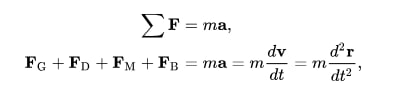
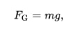
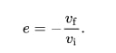

# Bouncing Ballz
## The physics of a bouncing ball

**The physics of a bouncing ball** concerns the physical behaviour of bouncing balls, particularly its motion *before*, *during*, and *after* impact against the surface of another body.

The motion of a bouncing ball obeys projectile motion. Many forces act on a real ball, namely the **gravitational force F(g)**, **the drag force** due to air resistance **F(d)**, the **Magnus force** due to the ball's spin **F(m)**, and the **buoyant force F(b)**. In general, one has to use ***Newton's second law*** taking all forces into account to analyze the ball's motion:



where **m** is the ball's mass. Here, **a**, **v**, **r** represent the ball's *acceleration*, *velocity*, and *position* over time **t**.

The gravitational force is directed downwards and is equal to



---

When a ball impacts a surface, the surface recoils and vibrates, as does the ball, creating both sound and heat, and the ball loses kinetic energy. Additionally, the impact can impart some rotation to the ball, transferring some of its translational kinetic energy into rotational kinetic energy. This energy loss is usually characterized (indirectly) through the ***coefficient of restitution*** (or **COR**, denoted e).



For a ball dropped against a floor, the COR will therefore vary between 0 (no bounce, total loss of energy) and 1 (perfectly bouncy, no energy loss). A COR value below 0 or above 1 is theoretically possible, but would indicate that the ball went through the surface (e < 0), or that the surface was not "relaxed" when the ball impacted it (e > 1), like in the case of a ball landing on spring-loaded platform.

## About Simulator

**Newton's second law** states that the *acceleration* of an object depends upon two variables – the net force acting on the object and the *mass* of the object 
**`F = ma`** => **`a = F / m`** in this case **`m = 1`**, So **`a = F`**

We know that **`F = mg`**, where **m** is the **mass** of the ball, and **g** is the *gravitational acceleration*, since **`m = 1`** therefore **`F = g`**, following Newton's second law and our conclusion that **`a = F`** it is clear that *(In our simulator, of course)* => ***`a = g`***, So *acceleration* = *gravitational acceleration*.

Ball bouncing is implemented according to **Newton's Third law**, which tells us that for each action there is an equal opposite reaction. 

## Usage

I used [vite](https://vitejs.dev/guide/) as Bundler.

*"Bundling": using tools that crawl, process and concatenate our source modules into files that can run in the browser.*

Vite requires Node.js version 20+. However, some templates require a higher Node.js version to work, please upgrade if your package manager warns about it.

```
git clone /repository's path/
```

```
npm i
npm run dev
```

You may run ```npm run build``` command to build the app.

By default, the build output will be placed at `dist`. You may deploy this `dist` folder to any of your preferred platforms.
Once you've built the app, you may test it locally by running ```npm run preview``` command.

```
npm run build
npm run preview
```
